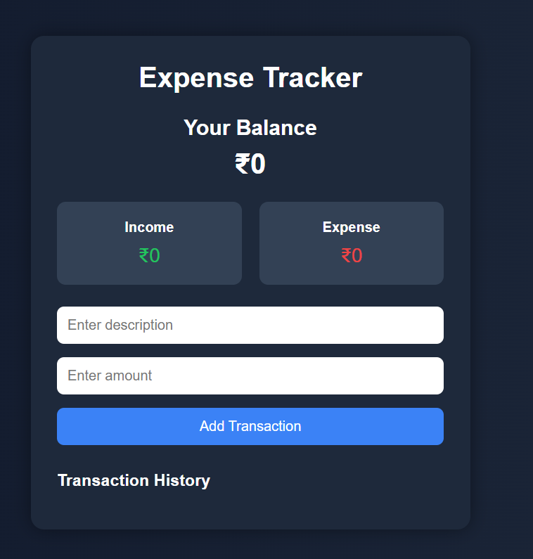

# 💰 Expense Tracker App

A responsive web application built using HTML, CSS, and JavaScript that helps users track income and expenses with real-time balance updates and local storage support.

---

## 🚀 Live Demo
https://expense-tracker-app-one-iota.vercel.app/

---

## ✨ Features

- Add income and expenses
- Real-time balance calculation
- Transaction history
- Delete transactions
- Local storage support (data persists after refresh)
- Responsive UI design

---

## 🛠️ Tech Stack

- HTML5
- CSS3
- JavaScript (Vanilla JS)
- Local Storage

---

## 📂 Project Structure

expense-tracker-app

- assets
  - images
    - preview.png

- index.html
- style.css
- script.js
- README.md

---

## 📸 Screenshot

---

## 👨‍💻 Author

Divya Prasoon  
Computer Science (Data Science) Student  
